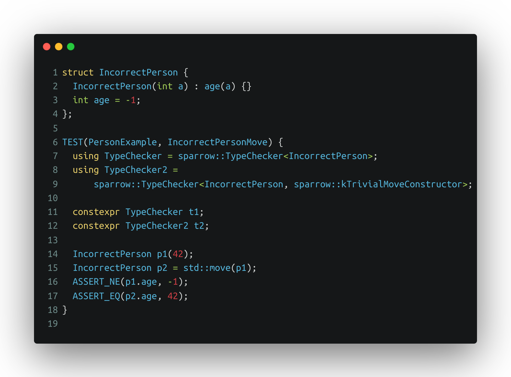
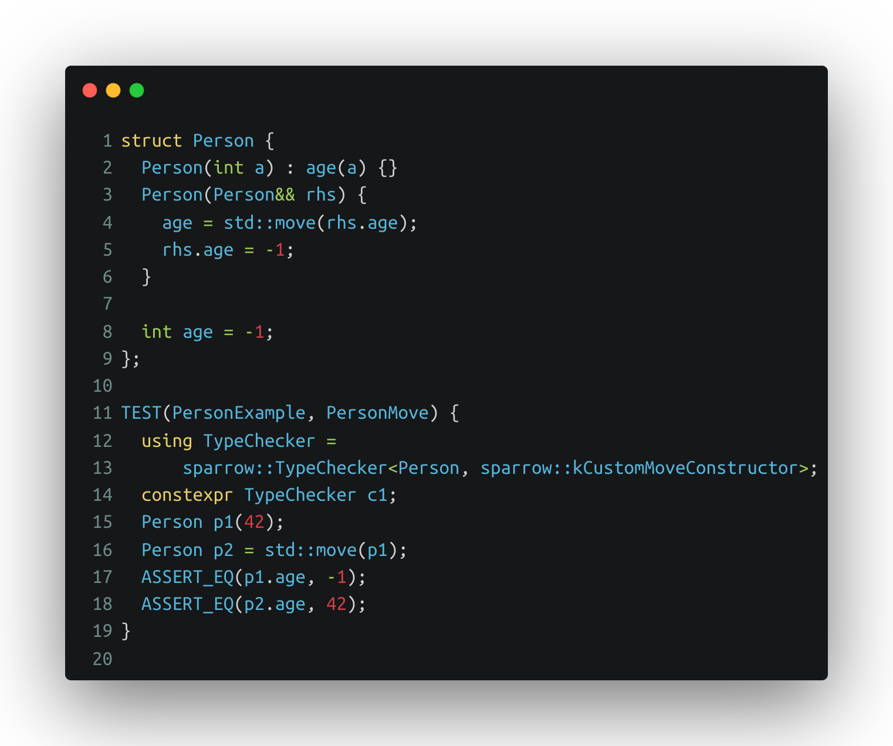
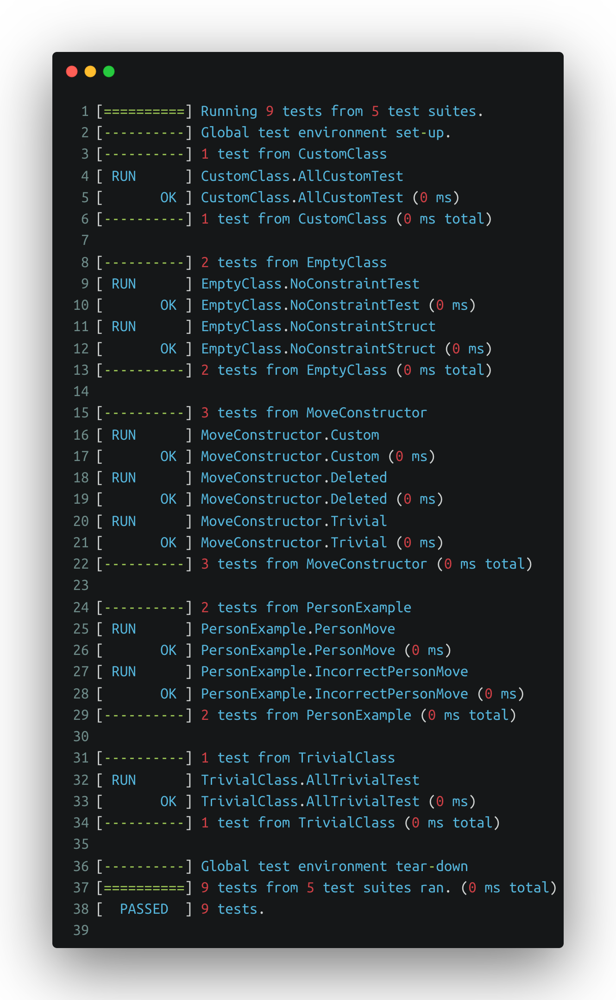

# Welcome to the sparrow!

## Intro
This header-only C++ template class allows you to enforce copy and move semantics on any class or struct.  It provides an easy-to-use solution for ensuring objects are copied and moved correctly, preventing unexpected behavior that can result in memory leaks or other issues.

The class template provides a simple and efficient way to implement the Rule of five in C++, making it easy to create copyable and movable objects with minimal boilerplate code.

The Rule of Five dictates that any class with a user-defined destructor, copy constructor, copy assignment operator, move constructor, or move assignment operator should implement all five of these methods. The template ensures that your class follows this rule based on the defined configuration, making remembering your code more manageable and preventing errors.

To get started, include the `sparrow.h` header file in your project and wrap your class or struct in the `sparrow::TypeChecker` template, and you're done! Your object will follow the rules and have a well-defined copy and move semantics.

We hope you find this class template helpful in your projects. Please feel free to contribute or provide feedback. Happy coding!

## Example

```c++
#include <gtest/gtest.h>

#include "sparrow.h"

struct Person {
  Person(int a) : age(a) {}
  Person(Person&& rhs) {
    age = std::move(rhs.age);
    rhs.age = -1;
  }

  int age = -1;
};

struct IncorrectPerson {
  IncorrectPerson(int a) : age(a) {}
  int age = -1;
};

TEST(PersonExample, PersonMove) {
  using TypeChecker =
      sparrow::TypeChecker<Person, sparrow::kCustomMoveConstructor>;
  constexpr TypeChecker c1;
  Person p1(42);
  Person p2 = std::move(p1);
  ASSERT_EQ(p1.age, -1);
  ASSERT_EQ(p2.age, 42);
}

TEST(PersonExample, IncorrectPersonMove) {
  using TypeChecker = sparrow::TypeChecker<IncorrectPerson>;
  using TypeChecker2 =
      sparrow::TypeChecker<IncorrectPerson, sparrow::kTrivialMoveConstructor>;

  constexpr TypeChecker t1;
  constexpr TypeChecker2 t2;

  IncorrectPerson p1(42);
  IncorrectPerson p2 = std::move(p1);
  ASSERT_NE(p1.age, -1);
  ASSERT_EQ(p2.age, 42);
}
```

The above code sample can be found here - [example](tests/person_example.cc)

### Incorrect move semantics
In this example, if we use the default move constructor provided by the compiler, p1 is in undefined state after moving (line no. 15 and 16).



### Fix the move semantics
We will now enforce that the move constructor must be defined and implemented by the author against using the default provided by the compiler!



With this change, we are now forcing the Person class to have its own move constructor.

## Building

From the root of the repository, you can issue

```
cmake -B build .
```

And then you can run
```
cmake --build build
```

## Building with static_assert compile time errors
To understand how this template raises static_asserts during compilation, please use the option `USE_COMPILER_ERROR` as

```
cmake -B build -DUSE_COMPILER_ERROR=ON .
```

And then you can run
```
cmake --build build -- -k
```
**NOTE**: Notice the `-- -k` option above.  This instructs cmake's make command to continue despite getting errors.

## Running
After building - without the `USE_COMPILER_ERROR` flag , run the tests as
```
build\sparrow_tests
```

You will see the results as -

